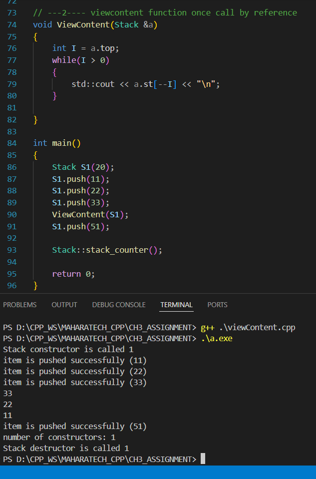

<!DOCTYPE html>
<html>
<head>
    <title>Assignment 2</title>
</head>
<body>
    <h1>Complete Stack Class:</h1>
    <h2>Try and Trace Code:</h2>
    <ul>
        <li>ViewContent function called by value and without copy constructor (to see the extra destructor call)</li>
        <li>ViewContent function called by reference</li>
        <li>ViewContent function called by value and with copy constructor</li>
    </ul>
    <h3>ViewContent Function Called by Value and Without Copy Constructor:</h3>
    
As we see in the next figure, when we pass the class as an argument to the standalone function, it makes a bitwise copy. When the function goes out of scope, it calls the destructor, so both the copy and the original class instance are deleted.

    
    <h3>Solutions:</h3>
    <h3>ViewContent Function Called by Value and With Copy Constructor:</h3>
    
    <h3>ViewContent Function Called by Reference:</h3>
    
    

    <h3>Additional Example:</h3>

</body>
</html>
